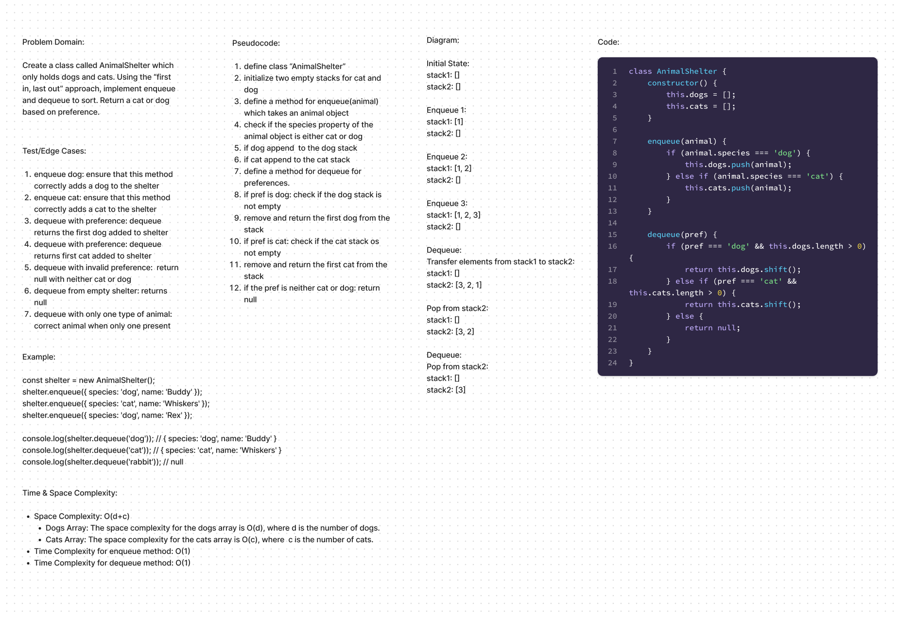

# Code Challenge 10

## Summary
Create a class called `AnimalShelter` which only holds dogs and cats. Using the “first in, first out” approach, implement `enqueue` and `dequeue` to sort. Return a cat or dog based on preference.

## Approach & Efficiency
The main challenge is to maintain the FIFO order using LIFO stacks. This is achieved by using one stack (`stack1`) to handle enqueue operations and another stack (`stack2`) for dequeue operations.

1. **Enqueue Operation:**
   - Simply push the new value onto `stack1`.
   - **Time Complexity:** O(1)
   - **Space Complexity:** O(1)

2. **Dequeue Operation:**
   - If `stack2` is empty, transfer all elements from `stack1` to `stack2` by popping from `stack1` and pushing onto `stack2`.
   - Pop the top element from `stack2`.
   - **Time Complexity:** Amortized O(1) per operation, worst-case O(n) when transferring elements.
   - **Space Complexity:** O(1)

## Tests
1. **Enqueue dog:** Ensure that this method correctly adds a dog to the shelter.
2. **Enqueue cat:** Ensure that this method correctly adds a cat to the shelter.
3. **Dequeue with preference (dog):** Ensure that the `dequeue` method returns the first dog added to the shelter.
4. **Dequeue with preference (cat):** Ensure that the `dequeue` method returns the first cat added to the shelter.
5. **Dequeue with invalid preference:** Ensure that the `dequeue` method returns `null` when the preference is neither "dog" nor "cat".
6. **Dequeue from an empty shelter:** Ensure that the `dequeue` method returns `null` when there are no animals in the shelter.
7. **Dequeue with only one type of animal:** Ensure that the `dequeue` method returns the correct animal when only one type is present in the shelter.

## Time & Space Complexity

**Space Complexity:** O(d + c)
- **Dogs Array:** The space complexity for the dogs array is O(d), where d is the number of dogs.
- **Cats Array:** The space complexity for the cats array is O(c), where c is the number of cats.

**Time Complexity:**
- **Enqueue method:** O(1)
- **Dequeue method:** O(1)

## Solution

[Link to code](./index.js)
