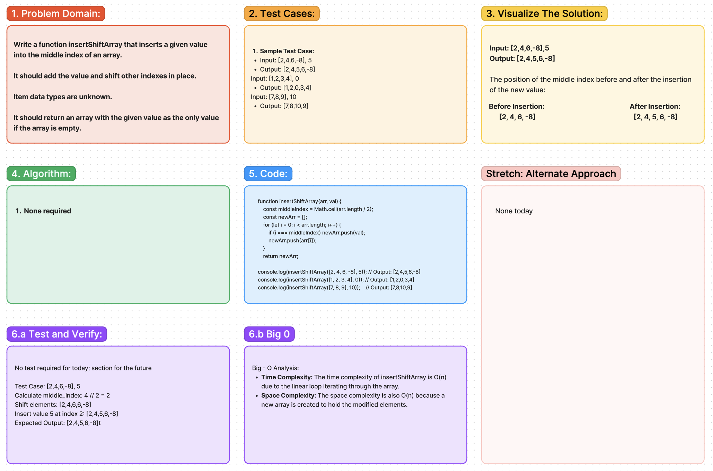

# Code Challenge 02: Array - Insert Shift

Write a second function that removes an element from the middle index and shifts other elements in the array to fill the new gap.

## Whiteboard Process:

### [Live Figma Link:](https://www.figma.com/file/syBkZhJ610zWISucBtYQM4/Whiteboard%3A-Array---Insert-Shift?type=whiteboard&node-id=0%3A1&t=nKXLxFwpIBxpeh1R-1)

## Approach & Efficiency:

The `inserShiftArray` function adds a value to the middle of an array. It works by:

1. Finding the middle of the original array by dividing its length by 2
2. Creating a new array to include this new value.
3. Copying elements from the original array to the new one. If the index is before the middle, elements are copied directly. At the middle, the new value is inserted. After the middle, elements are shifted right by one position.
4. The new array, with the value inserted, is then returned.

---
### Big O
Time Complexity: The time complexity of insertShiftArray is O(n) due to the linear loop iterating through the array.

Space Complexity: The space complexity is also O(n) because a new array is created to hold the modified elements.
## Solution:

    function insertShiftArray(arr = [], val) {
    for (let i = 0; i < Math.floor(arr.length / 2); i++) {
      arr[arr.length - i] = arr[arr.length - (i + 1)];
    }

    arr[Math.floor(arr.length / 2)] = val;

    return arr;

    }
