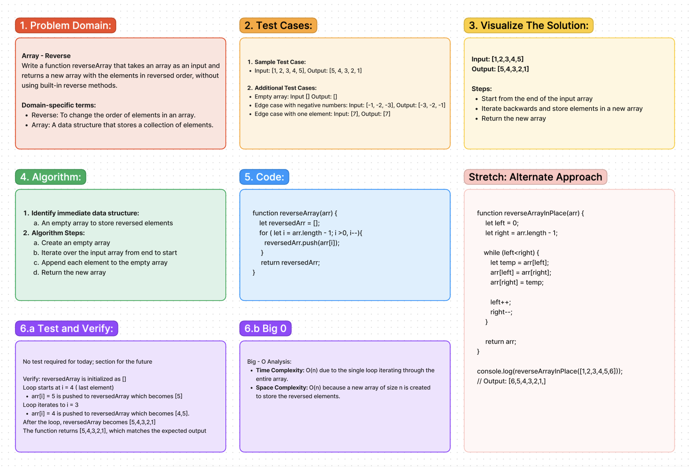

# Code Challenge 01: Array - Reverse

 Write a function reverseArray that takes an array as input and returns a new array with the elements in reversed order, without using built-in reverse methods.

## Whiteboard Process:
### [Live Figma Link:](https://www.figma.com/file/NrXypGc2zOzI4oEeB6Dywr/Whiteboard%3A-Array---Reverse?type=whiteboard&node-id=0%3A1&t=7z6BBfUdKwmY3omc-1)

## Approach & Efficiency:
Class Demo: We reversed the array by swapping the outside pair inwardly.

## Solution:
No code required for this challenge.

[Click to View Alternative Code](./reverse-array.js)
