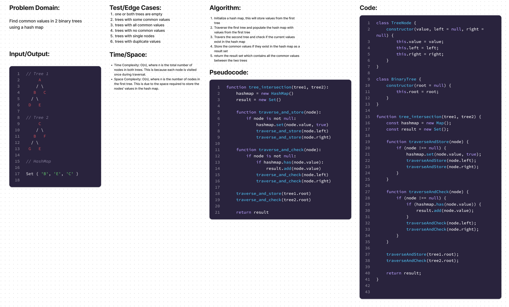

# Hash Table - Common Values in Two Binary Trees

## Feature Tasks

Write a function called tree_intersection that takes two binary trees as parameters. Using your HashMap implementation as a part of your algorithm, return a set of values found in both trees.

Arguments: Two binary trees

Return: Set of values found in both trees

## UML:

