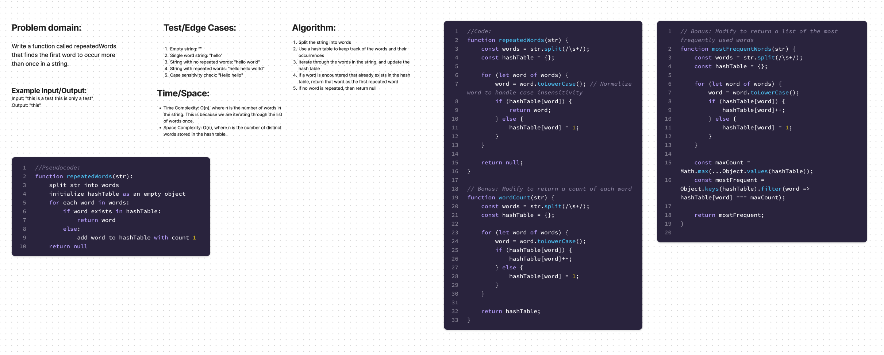

# Hash Table - Repeated Words

## Feature Tasks

Write a function called repeated word that finds the first word to occur more than once in a string

1. Arguments: String
2. Return: String

## Stretch Goal:

1. Modify your function to return a count of each of the words in the provided string
2. Modify your function to return a list of the words most frequently used in the provided string

## UML:

