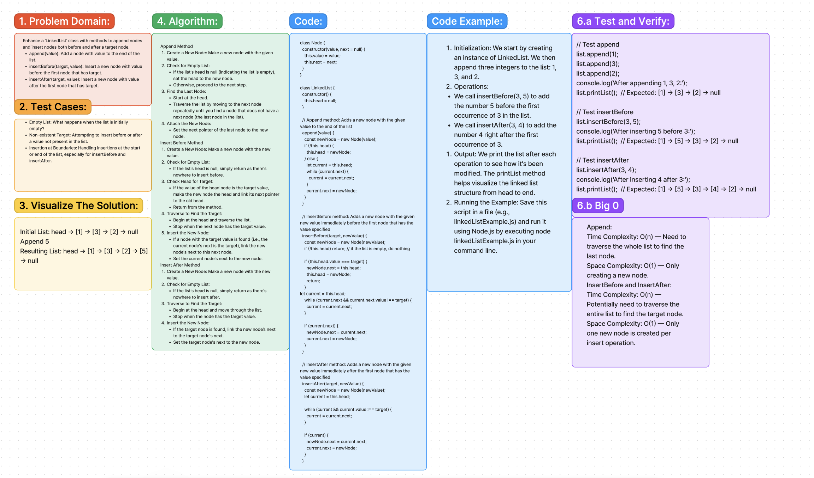

# Code Challenge 6

## Summary:

This challenge involves implementing various insertion methods in a linked list data structure.

## Description:

The goal is to extend the functionality of a basic linked list to support `append`, `insertBefore`, and `insertAfter` operations.

## Approach & Efficiency:

### Tests:

1. Test appending to an empty list.

2. Test inserting before the head and in the middle.

3. Test inserting after the tail and in the middle.

4. Negative test where the target does not exist.

### Time & Space Complexity:

**Append:**

Time Complexity: O(n) since you may need to traverse the entire list.

Space Complexity: O(1) as no additional space is required proportional to the input size.

**InsertBefore and InsertAfter:**

Time Complexity: O(n) because in the worst case you traverse the whole list.

Space Complexity: O(1) as you're only creating a single new node.

## Solution:

[Link to code](./index.js)
