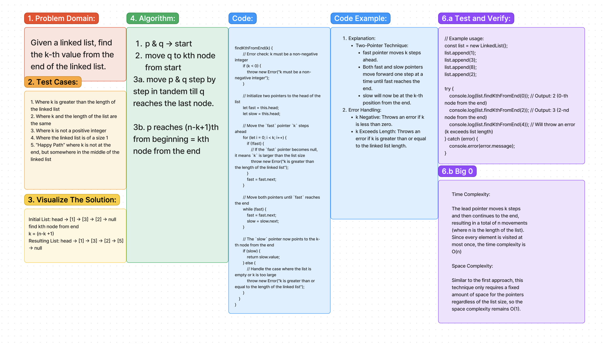

# Code Challenge 7

## Summary:
This challenge involves getting the k-th value from the end of a linked list.

## Description:

Write the following method for the Linked List class:

  kth from end
  • argument: a number, k, as a parameter.

  • Return the node’s value that is k places from the tail of the linked list.

  • You have access to the Node class and all the properties on the Linked List class as well as the methods created in previous challenges.

k = (n-k +1)
## Approach & Efficiency:

### Tests:

1. Where k is greater than the length of the linked list
2. Where k and the length of the list are the same
3. Where k is not a positive integer
4. Where the linked list is of a size 1
5. “Happy Path” where k is not at the end, but somewhere in the middle of the linked list

### Time & Space Complexity:

1. Pointer Setup: Use two pointers, lead and follow. Move the lead pointer k nodes ahead in the list.
2. Traversal: Move both lead and follow pointers simultaneously until lead reaches the end of the list. At this point, follow will point to the k-th node from the end.

#### Time Complexity:

The lead pointer moves k steps and then continues to the end, resulting in a total of n movements (where n is the length of the list).
Since every element is visited at most once, the time complexity is O(n)

#### Space Complexity:

Similar to the first approach, this technique only requires a fixed amount of space for the pointers regardless of the list size, so the space complexity remains O(1).
## Solution:

[Link to code](./index.js)
