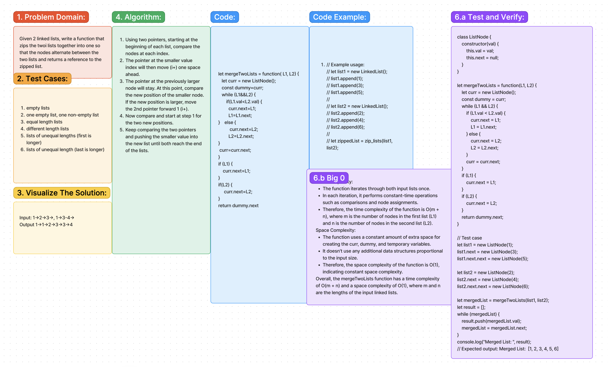

# Code Challenge 7

## Summary:

Given 2 linked lists, write a function that zips the two lists together into one so that the nodes alternate between the two lists and returns a reference to the zipped list.

## Approach & Efficiency:

1. Using two pointers, starting at the beginning of each list, compare the nodes at each index.
2. The pointer at the smaller value index will then move (i+) one space ahead.
3. The pointer at the previously larger node will stay. At this point, compare the new position of the smaller node. If the new position is larger, move the 2nd pointer forward 1 (i+).
4. Now compare and start at step 1 for the two new positions.
5. Keep comparing the two pointers and pushing the smaller value into the new list until both reach the end of the lists.

### Tests:

1. Empty lists
2. One empty list, one non-empty list
3. Equal length lists
4. Different length lists
5. Lists of unequal lengths (first is longer)
6. Lists of unequal length (last is longer)

### Time & Space Complexity:

### Time Complexity:
The function iterates through both input lists once.
In each iteration, it performs constant-time operations such as comparisons and node assignments.

Therefore, the time complexity of the function is O(m + n), where m is the number of nodes in the first list (L1) and n is the number of nodes in the second list (L2).

### Space Complexity:
The function uses a constant amount of extra space for creating the curr, dummy, and temporary variables.

It doesn't use any additional data structures proportional to the input size.
Therefore, the space complexity of the function is O(1), indicating constant space complexity.

Overall, the mergeTwoLists function has a time complexity of O(m + n) and a space complexity of O(1), where m and n are the lengths of the input linked lists.

## Solution:

[Link to code](./index.js)
