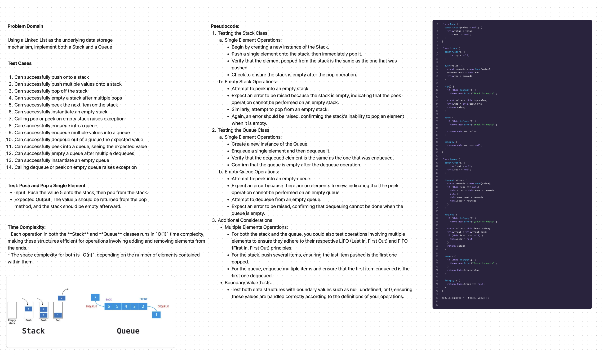

# Code Challenge 8

## Summary:

Using a Linked List as the underlying data storage mechanism, implement both a Stack and a Queue

## Description:

The goal is to extend the functionality of a basic linked list to support `append`, `insertBefore`, and `insertAfter` operations.

## Approach & Efficiency:

### Tests:

1. Can successfully push onto a stack
2. Can successfully push multiple values onto a stack
3. Can successfully pop off the stack
4. Can successfully empty a stack after multiple pops
5. Can successfully peek the next item on the stack
6. Can successfully instantiate an empty stack
7. Calling pop or peek on empty stack raises exception
8. Can successfully enqueue into a queue
9. Can successfully enqueue multiple values into a queue
10. Can successfully dequeue out of a queue the expected value
11. Can successfully peek into a queue, seeing the expected value
12. Can successfully empty a queue after multiple dequeues
13. Can successfully instantiate an empty queue
14. Calling dequeue or peek on empty queue raises exception

## Stack and Queue Test Cases

## Empty Stack Operations

- **Attempt to `pop` from an empty stack**: Should raise an error.
- **Attempt to `peek` into an empty stack**: Should raise an error.

## Single Element Operations

- **Push a single element and then `pop` it**: Should return the element and empty the stack.
- **Push a single element, `peek` to check the element**: Confirm that the stack is not empty.

## Multiple Elements Operations

- **Push several elements**: Ensure the last pushed is the first popped (LIFO order).
- **Continuously `peek` after multiple pushes**: Ensure the top is correct without removing it.

## Boundary Values

- **Push boundary values** like `null`, `undefined`, or `0`: Ensure they are handled correctly.

## Queue

## Empty Queue Operations

- **Attempt to `dequeue` from an empty queue**: Should raise an error.
- **Attempt to `peek` into an empty queue**: Should raise an error.

## Single Element Operations

- **Enqueue a single element and then `dequeue` it**: Should return the element and empty the queue.
- **Enqueue a single element, `peek` to check the element**: Confirm that the queue is not empty.

## Multiple Elements Operations

- **Enqueue several elements**: Ensure the first enqueued is the first dequeued (FIFO order).
- **Continuously `peek` after multiple enqueues**: Ensure the front is correct without removing it.

## Boundary Values

- **Enqueue boundary values** like `null`, `undefined`, or `0`: Ensure they are handled correctly.

### Time & Space Complexity:

## Stack Operations

### `push(value): O(1)`

- Adds a new node at the top of the stack.
- This operation does not depend on the size of the stack, as it only involves adjusting a few pointers.

### `pop(): O(1)`

- Removes the node from the top of the stack.
- Similar to `push`, this only involves manipulating the top pointer and does not depend on the stack's size.

### `peek(): O(1)`

- Returns the value of the node at the top of the stack.
- This operation accesses a single node, hence it has a constant time complexity.

### `isEmpty(): O(1)`

- Checks if the stack is empty by verifying if the top pointer is `null`.
- A direct access and comparison operation, making it constant time.

## Queue Operations

### `enqueue(value): O(1)`

- Adds a new node at the rear of the queue.
- Since the rear pointer is maintained, appending to the queue does not require traversing it. Therefore, this operation is constant time.

### `dequeue(): O(1)`

- Removes the node from the front of the queue.
- With direct access to the front pointer, this operation is done in constant time. Adjusting the front and possibly the rear pointers does not depend on the size of the queue.

### `peek(): O(1)`

- Returns the value of the node at the front of the queue.
- Like `peek` in the stack, this operation accesses only one node and thus has a constant time complexity.

### `isEmpty(): O(1)`

- Checks if the queue is empty by verifying if the front pointer is `null`.
- This is a direct check and therefore has a constant time complexity.

## Space Complexity

- Both the **Stack** and **Queue** classes have a space complexity of `O(n)`, where `n` is the number of elements in the stack or queue.
- The space required grows linearly with the number of elements stored in these data structures.

## Summary

- Each operation in both the **Stack** and **Queue** classes runs in `O(1)` time complexity, making these structures efficient for operations involving adding and removing elements from the ends.
- The space complexity for both is `O(n)`, depending on the number of elements contained within them.

## Solution:

[Link to code](./index.js)
