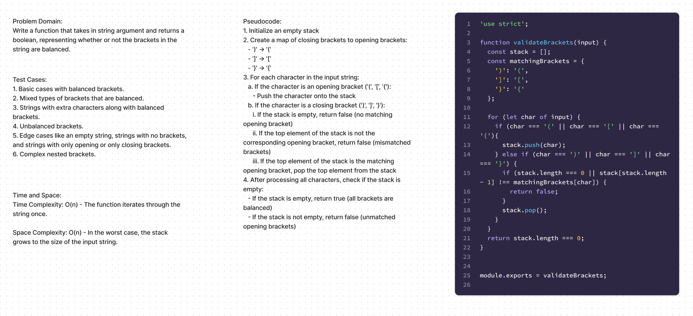

# Code Challenge 11

## Summary
Write a function that takes in string argument and returns a boolean, representing whether or not the brackets in the string are balanced.

## Approach & Efficiency

The approach to solving the problem of balanced brackets involves using a stack data structure. The function validateBrackets iterates through each character of the input string. When an opening bracket ((, [, {) is encountered, it is pushed onto the stack. When a closing bracket (), ], }) is encountered, the function checks if the top of the stack has the corresponding opening bracket. If it does, the opening bracket is popped from the stack; otherwise, the function returns false. Finally, after processing all characters, the function returns true if the stack is empty, indicating that all brackets are balanced.
## Tests
1. Basic cases with balanced brackets.
2. Mixed types of brackets that are balanced.
3. Strings with extra characters along with balanced brackets.
4. Unbalanced brackets.
5. Edge cases like an empty string, strings with no brackets, and strings with only opening or only closing brackets.
6. Complex nested brackets.

## Time & Space Complexity

Time Complexity: O(n) - The function iterates through the string once.

Space Complexity: O(n) - In the worst case, the stack grows to the size of the input string.

## Solution

[Link to code](./index.js)
