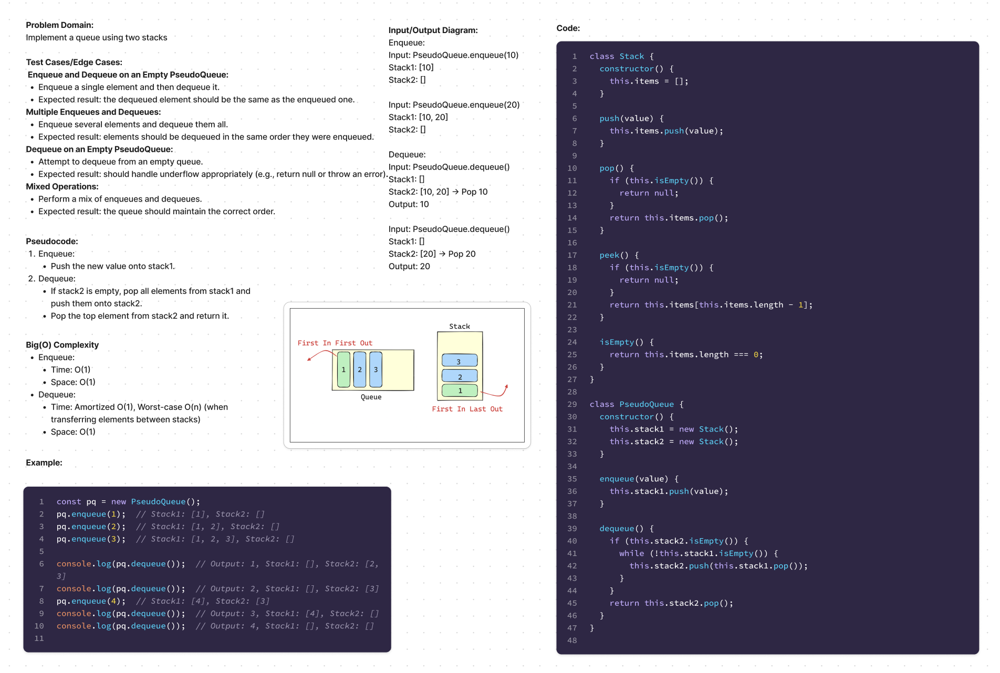

# Code Challenge 9

## Summary
Implement a queue using two stacks. This involves creating a `PseudoQueue` class that uses two instances of a `Stack` class to mimic the behavior of a queue.

## Description
The `PseudoQueue` class should provide two methods:
- `enqueue(value)`: Inserts a value into the queue following the first-in, first-out (FIFO) principle.
- `dequeue()`: Removes and returns a value from the queue following the FIFO principle.

Internally, the `PseudoQueue` class will use two stack instances (`stack1` and `stack2`) to manage the queue operations. The `Stack` class will have standard stack operations (`push`, `pop`, and `peek`).

## Approach & Efficiency
The main challenge is to maintain the FIFO order using LIFO stacks. This is achieved by using one stack (`stack1`) to handle enqueue operations and another stack (`stack2`) for dequeue operations.

1. **Enqueue Operation:**
   - Simply push the new value onto `stack1`.
   - Time Complexity: O(1)
   - Space Complexity: O(1)

2. **Dequeue Operation:**
   - If `stack2` is empty, transfer all elements from `stack1` to `stack2` by popping from `stack1` and pushing onto `stack2`.
   - Pop the top element from `stack2`.
   - Time Complexity: Amortized O(1) per operation, worst-case O(n) when transferring elements.
   - Space Complexity: O(1)

## Tests
1. **Instantiate an empty `PseudoQueue`:**
   - Verify that both internal stacks are empty.

2. **Enqueue elements:**
   - Enqueue multiple elements and verify the internal state of `stack1`.

3. **Dequeue elements in FIFO order:**
   - Enqueue multiple elements, then dequeue them and check the order of the output.

4. **Dequeue from an empty `PseudoQueue`:**
   - Ensure the method handles underflow correctly (e.g., returns `null`).

5. **Mixed operations:**
   - Perform a mix of enqueue and dequeue operations and verify the correct order is maintained.

## Time & Space Complexity
- **Enqueue:**
  - Time: O(1)
  - Space: O(1)

- **Dequeue:**
  - Time: Amortized O(1), worst-case O(n)
  - Space: O(1)

## Solution

[Link to code](./index.js)
