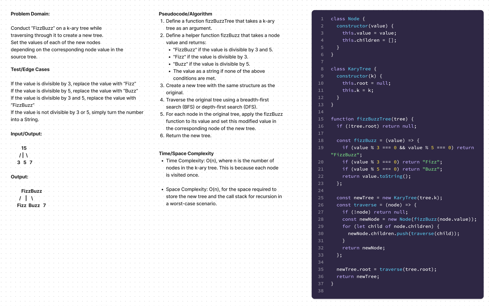

# Code Challenge Class 18

### Problem Domain:

Conduct “FizzBuzz” on a k-ary tree while traversing through it to create a new tree.
Set the values of each of the new nodes depending on the corresponding node value in the source tree.

#### Feature Tasks
Write a function called fizz buzz tree

Arguments: k-ary tree

Return: new k-ary tree

Determine whether or not the value of each node is divisible by 3, 5 or both. Create a new tree with the same structure as the original, but the values modified as follows:

1. If the value is divisible by 3, replace the value with “Fizz”

2. If the value is divisible by 5, replace the value with “Buzz”

3. If the value is divisible by 3 and 5, replace the value with “FizzBuzz”

4. If the value is not divisible by 3 or 5, simply turn the number into a String.

----

### Time/Space Complexity:

Time Complexity: O(n), where n is the number of nodes in the k-ary tree. This is because each node is visited once.

Space Complexity: O(n), for the space required to store the new tree and the call stack for recursion in a worst-case scenario.

